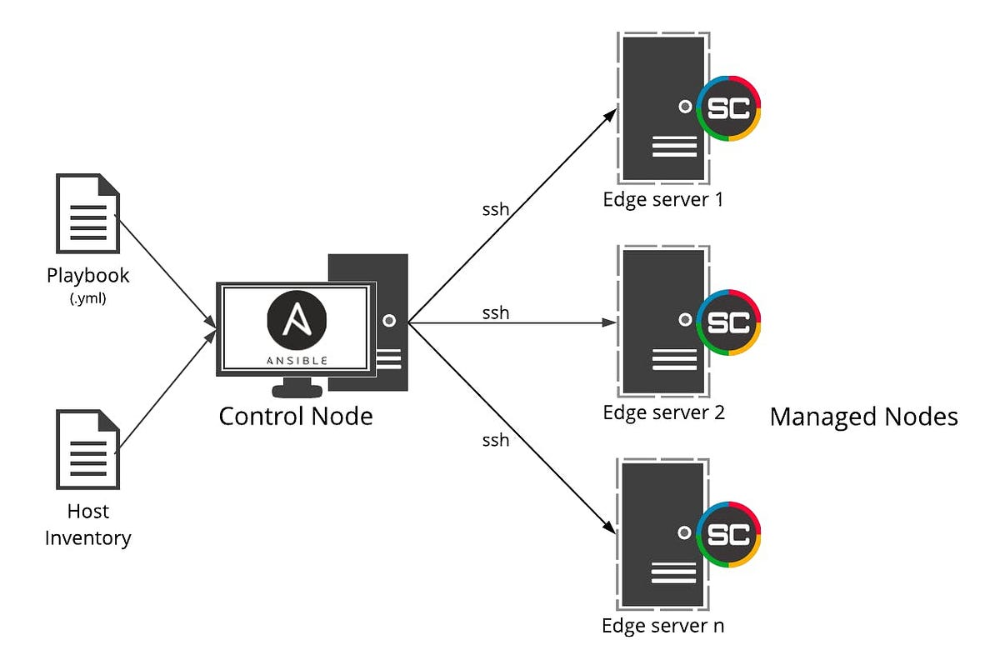

# 🏠 Bootstrap

**[Notes](#Notes) • [Overview](#Requirements)**

<br>

## 📖 Overview

> [!NOTE]
>
> This project is targetted at users who only work from a Windows machine, and therefor only tested with Ubuntu 22.04 Server.  If you are running Mac and Linux already, you'll have to [configure the compiler and libaries](#) from source yourself.

Historically, managing Tibia private servers involved manually setting up and maintaining [XAMPP](https://www.apachefriends.org/), [MySQL](https://www.mysql.com/), and [PHPMyAdmin](https://www.phpmyadmin.net/) on Windows machines, which required direct intervention for troubleshooting and service management.  Often this meant to develop and test new code, you would have to creates sets of the web server stack and code to develop on... which becomes very cumbersome.

Although the open source Tibia dev community hasn't transitioned entirely into a microservice architectures - they are beginning to port services to Linux and supporting [Docker](https://www.docker.com/).  This offers significant advantages by decoupling services into independent containers, enhancing fault tolerance, scalability, and deployment consistency. Additionally, using [Ansible](https://www.ansible.com/) for configuring development and test environments automates setup tasks, ensures consistency across environments, and reduces manual errors.

This repository contains all the information required to set up a test/dev environment and simplify compiling.  The Ansible [playbook](ansible\bootstrap\playbooks\initialise.yml) and scripts in the project will take you through creating a VM on your Windows machine that runs [Ubuntu 22.04 desktop](https://releases.ubuntu.com/jammy/).  You will be able to work on your own isolated copy of the latest server, client, launcher and login proxy without haven't to go through too much effort to set anything up initially.  Beyond setting up just the server repositories and developer environment, it also configures what's described in the article ["My First 5 Minutes On A Server; Or, Essential Security for Linux Servers"](https://web.archive.org/web/20201112012219/https://plusbryan.com/my-first-5-minutes-on-a-server-or-essential-security-for-linux-servers). 

<br>

### Ansible
For a brief rundown on what Ansible is and what it's used for see [here](https://pronteff.com/understanding-ansible-concepts/).



<br>

## Requirements

> [!NOTE]
>
> Typically you would [PXE boot](https://www.reddit.com/r/homelab/comments/p4v4w4/eli5_pxe_boot_how_do_i_simply_install_ubuntu_from/) a group of machines using another service with a linux distro.. but even ansible is overkill for this project so we are manually installing the VM.

Prior to executing any playbooks, you are required to set up a managed node (a Ubuntu Desktop 22.04 VM using VMWare Workstation) and a control node (your current machine with some small software installations).

### Managed Node

#### VMWare WorkStattion 17.5 
Firstly, download and install [VMWare](https://softwareupdate.vmware.com/cds/vmw-desktop/ws/17.5.1/23298084/windows/core/).

#### Ubuntu Desktop 22.04
After that, create a new VM in VMWare with an AMD64 ISO from [here](https://releases.ubuntu.com/jammy/).  

When setting up the profile for the first time, set:
- username: ```user```
- password: ```password```

### Control Node
Next, you'll need to [set up a UNIX environment](https://docs.ansible.com/ansible/latest/installation_guide/index.html) on your managed node to run ansible run.  Unfortunately Windows is not support as a control node out the box with Ansible, so there will be scripts and docs on how to quickly get this ready. 
- Run `ansible-galaxy install -r requirements.yml` to install the dependencies.

<br>

## Initial Setup

### SSH Server
If you didn't enable this during your Ubuntu installation, set up the SSH server so that your control machine can talk to your managed node via SSH.

```sh
sudo apt update
sudo apt install openssh-server
sudo systemctl start ssh
sudo systemctl enable ssh
```

### Finding your Ubuntu IP

To find the IP address of your new machine, open a terminal in Ubutnu and use:
```sh
# To copy from a VM it's often easiest to right click and select copy
ip addr show ens33 | grep -oP 'inet \K[\d.]+'
```

Back on your control machine export the server IP as a temporary environment variable using:
```sh
export SERVER_IP=
```

Also export the username we used in the creation of the server:
```sh
export SERVER_USER=user
```

### SSH key pairs
Follow best practices, we'll generate a signed SSH key and place the tail in your control node so that after this process, your VM is secured.

```zsh
ssh-keygen -t rsa -b 4096
```

Copy the public key to your managed node(s).  Each time you try to connect via a terminal to your VM, your managed machine will match the other half of the key to what you've just generated.
```zsh
ssh-copy-id $SERVER_USER@$SERVER_IP
```

<br>

## Installation

### Updating secrets

Secrets are contained in an encrypted ansible yaml that can be repackaged to your choosing. By default the vault password is 'password'.  If you would like to improve the security, you can rekey the vault with something more reasonable/secure, and also update the values for the root and dev user of the ubuntu server.

```sh
# Required
task secrets:copy # creates a copy of the secrets vault (this copy will only ever exist on your local machine)
task secrets:host host=$SERVER_IP # creates a copy of the host file (this copy will only ever exist on your local machine)

# Optional
task secrets:rekey # used to update the vault password
task secrets:edit # opens a vim editor to change secrets used for deployments
```

### Baseline configurations

This is the baseline for most servers with some tweaks for simplicity: 

- change the root password
- add an "admin" user (username of your choice)
- add your public key to `.ssh/authorized_keys` for the admin user
- add that admin user to `/etc/sudoers`
- install [ufw](https://launchpad.net/ufw) (uncomplicated firewall, an iptables frontend) and [fail2ban](https://www.fail2ban.org/)
- SSH: disallow password authentication
- SSH: disallow root login
- setup firewall to allow SSH traffic
- install additional apt packages provided by the user
- add your public key to the authorized keys of the deploy user
- create a 4GB file at `/swapfile` and swap on it
- set sysctl `vm.swappiness = 60` to assist with compiling

### Running the playbook

Finally, trigger the playbook to run via:

```sh
# BECOME password & vault-password are 'password' by default
task ansible:run
```

<br>

## Tunnelling

Now that the web-server, game-server, database and proxy are configured, you can create a tunnel from your main operating machine to the linux vm (if you'd prefer to run the windows client or browse the services from your Windows side).
```sh
# Open a new terminal in the managed machine and run:
ssh -L 8080:localhost:80 -L 7171:localhost:7171 -L 7172:localhost:7172 -L 22:localhost:22 -L 3306:localhost:3306 $SERVER_USER@$SERVER_IP
```

<br>

## 📁 Directories

This Git repository contains the following directories:

```zsh
📁 homelab
├── 📁 docs                 # 
│   └── 📁 notes            #          
└── 📁 ansible              # 
    └── 📁 bootstrap        # 
```

<br>

### Furture Improvements

- Improve new user creation and swap
- Add a remote secret server (HashiCorp, AWS?)
- Rather than force clone, use git stash
