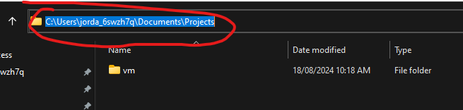
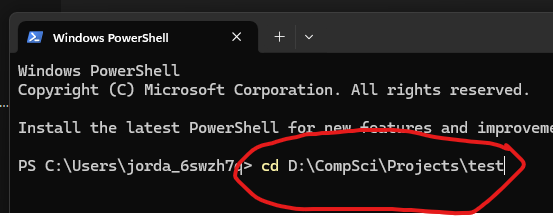
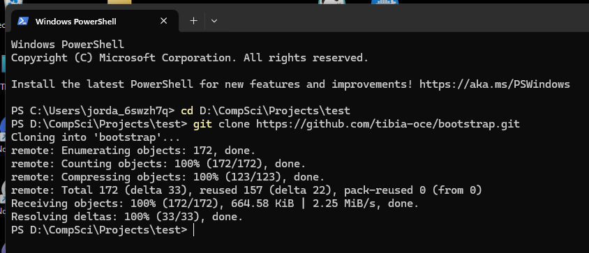

# 🏠 Bootstrap

**[Notes](#Notes) • [Overview](#📖-Overview) • [Requirements](#Requirements) • [Installation](#Installation)**

<br>

## 📖 Overview

> [!NOTE]
>
> This project is targetted at users who only work from a Windows machine, and therefor only tested with Ubuntu 22.04 Server.  If you are running Mac and Linux already, you'll have to [configure the compiler and libaries](#) from source yourself.

Historically, managing Tibia private servers involved manually setting up and maintaining [XAMPP](https://www.apachefriends.org/), [MySQL](https://www.mysql.com/), and [PHPMyAdmin](https://www.phpmyadmin.net/) on Windows machines, which required direct intervention for troubleshooting and service management.  Often this meant to develop and test new code, you would have to creates sets of the web server stack and code to develop on... which becomes very cumbersome.

Although the open source Tibia dev community hasn't transitioned entirely into a microservice architectures - they are beginning to port services to Linux and supporting [Docker](https://www.docker.com/).  This offers significant advantages by decoupling services into independent containers, enhancing fault tolerance, scalability, and deployment consistency. Additionally, using [Ansible](https://www.ansible.com/) for configuring development and test environments automates setup tasks, ensures consistency across environments, and reduces manual errors.

This repository contains all the information required to set up a test/dev environment and simplify compiling.  The Ansible [playbook](ansible\bootstrap\playbooks\initialise.yml) and scripts in the project will take you through creating a VM on your Windows machine that runs [Ubuntu 22.04 desktop](https://releases.ubuntu.com/jammy/).  You will be able to work on your own isolated copy of the latest server, client, launcher and login proxy without haven't to go through too much effort to set anything up initially.  Beyond setting up just the server repositories and developer environment, it also configures what's described in the article ["My First 5 Minutes On A Server; Or, Essential Security for Linux Servers"](https://web.archive.org/web/20201112012219/https://plusbryan.com/my-first-5-minutes-on-a-server-or-essential-security-for-linux-servers). 

<br>

### Ansible
For a brief rundown on what Ansible is and what it's used for see [here](https://pronteff.com/understanding-ansible-concepts/).


<br>

## Requirements

> [!NOTE]
>
> If you are new to developing, follow this [guide](#New-to-git) first, then return here. 

Prior to executing any playbooks, you are required to set up a managed node (a Ubuntu Desktop 22.04 VM using VMWare Workstation) and a control node (your current machine with some small software installations).  

### Setting up your control node

Because Ansible requires a bash environment, we'll be using WSL on Windows, to allow us to use Linux applications and Bash command-line tools directly on Windows.  This is different from the VM WorkStation we will be setting up!

1. Install an instance of [Ubuntu through WSL](https://learn.microsoft.com/en-us/windows/wsl/install).  You may require rebooting your machine after this step, and repeating the command.
    ```bash
    wsl --install -d Ubuntu
    ```

2. Once the install is finished, close that terminal, open another powershell/cmd prompt from the project directory (../bootstrap) and run:
    ```bash
    wsl -d Ubuntu
    ```

3. Install 'task' (this will be used to shortcut a number of commands throughout this project)
    ```bash
    sudo snap install task --classic
    ```

4. Install python and launch a virtual environment to set up Ansible in (this may take a few minutes).
    ```bash
    # The password prompt is for your VM
    task environment:python
    ```

### Setting up your managed node (Ubuntu Desktop 22.04)

Typically you would [PXE boot](https://www.reddit.com/r/homelab/comments/p4v4w4/eli5_pxe_boot_how_do_i_simply_install_ubuntu_from/) a group of machines automatically using another service.. but even ansible is overkill for this project so we are manually installing a VM.

1. Firstly, download and install [VMWare](https://softwareupdate.vmware.com/cds/vmw-desktop/ws/17.5.1/23298084/windows/core/).

2. After that, create a new VM in VMWare with an AMD64 ISO from [here](https://releases.ubuntu.com/jammy/).  

3. When setting up the profile for the first time, set:
    - username: ```user```
    - password: ```password```

4. If you didn't enable this during your Ubuntu installation, set up the SSH server so that your control machine can talk to your managed node via SSH.
    ```
    # Open a new terminal and run:
    sudo apt update
    sudo apt install openssh-server
    sudo systemctl start ssh
    sudo systemctl enable ssh
    ```

5. To find the IP address of the VM, use:
    ```sh
    # To copy from a VM it's often easiest to right click and select copy
    ip addr show ens33 | grep -oP 'inet \K[\d.]+'
    ```


<br>

## Installation

> [!NOTE]
>
> Secrets are contained in an encrypted ansible yaml that can be repackaged to your choosing. By default the vault password is 'password'.  If you would like to improve the security, you can [rekey the vault](#Updating-secrets) with something more reasonable/secure, and also update the values for the root and dev user of the ubuntu server.

### Copy required configs

1. Back on your control machine, we'll generate a signed SSH key and place the tail in your control node so that after this process, your VM is secured:
    ```sh
    # Enter your VM IP address from above (optional: user)
    task environment:keys host=192.168.238.142
    ```

2. This task will copy the dummy secrets and host name files.  It will update the host list with the value you provide. 
    ```sh
    task secrets:copy host=192.168.238.142 # Where '0.0.0.0' is the IP from the previous command
    ```

### Running the playbook

3. Then, trigger the playbook to run via:
    ```sh
    # By default, vault password is 'password'
    task ansible:run
    ```

<br>

## Additional

### Cleanup

1. Remove WSL Ubuntu installation:
```wsl --unregister Ubuntu```

### Updating secrets

If you would like to improve the security, you can rekey the vault with something more reasonable/secure, and also update the values for the root and dev user of the ubuntu server.  Most of these scripts are idempotent and configurable, so you can go back through the entire process again after creating a new VM with a different set of credentials and simply pass the new values.

```sh
# Optional
task secrets:rekey # used to update the vault password
task secrets:edit # opens a vim editor to change secrets used for deployments
```

### Tunnelling

Now that the web-server, game-server, database and proxy are configured, you can create a tunnel from your main operating machine to the linux vm (if you'd prefer to run the windows client or browse the services from your Windows side).
```sh
# Open a new terminal in the managed machine and run:
ssh -L 8080:localhost:80 -L 7171:localhost:7171 -L 7172:localhost:7172 -L 22:localhost:22 -L 3306:localhost:3306 $SERVER_USER@$SERVER_IP
```

<br>

## Furture Improvements

- Improve new user creation and deploy user creation/swap
- Rather than force clone on vcpkg, use git stash
- Add a remote secret server (HashiCorp, AWS?)

<br>

## New to git

1. To work through this repository you will require first installing [Git](https://github.com/git-for-windows/git/releases/download/v2.46.0.windows.1/Git-2.46.0-64-bit.exe).

2. Next you need to allocate a folder to download this projects code to.. Use something like `../Documents/Projects/`



3. Copy the path of the new folder you've created and open a powershell terminal

4. While you are here, it might be a good practice to create a new folder the VM installation (name it something like "Ubuntu")

5. Navigate the powershell terminal to the folder by using:
    ```cd [PASTE PATH AFTER A SPACE]```



6. Next, download the project to your own machine from github using 
    `git clone https://github.com/tibia-oce/bootstrap.git`.



7. Finally, navigate your powershell terminal into the new project download
    ```cd bootstrap```

8. Open PowerShell as Administrator (Start menu > PowerShell > right-click > Run as Administrator) and enter this command:
    ```dism.exe /online /enable-feature /featurename:Microsoft-Windows-Subsystem-Linux /all /norestart```

9. https://www.microsoft.com/store/productId/9PDXGNCFSCZV?ocid=pdpshare

10. You are now ready to continue on with the rest of the [installation guide](#control-node).

