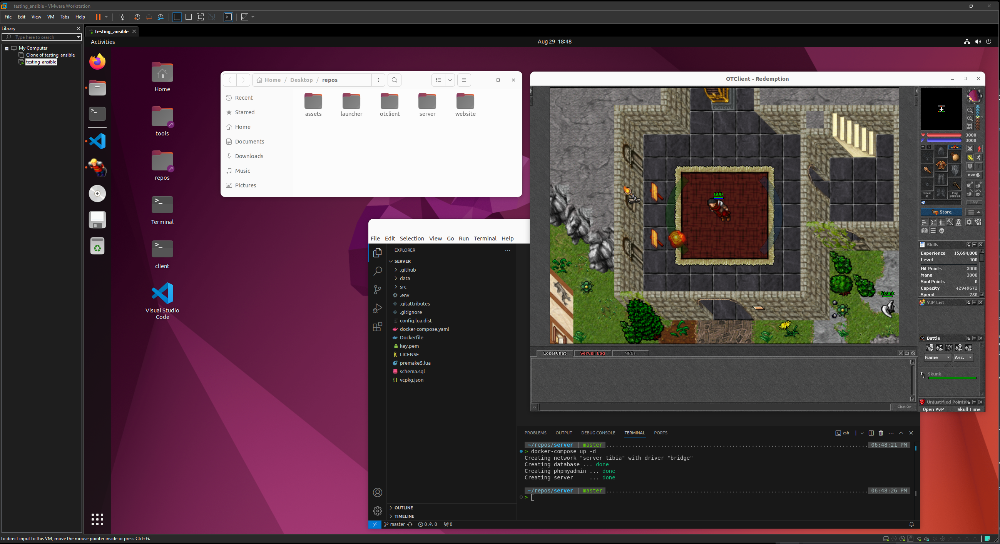
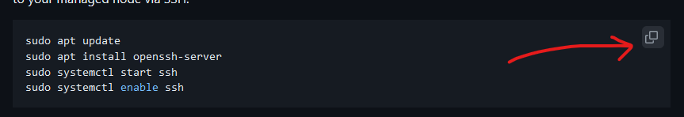
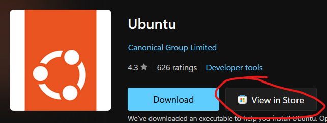

# 🏠 Bootstrap

**[Notes](#Notes) • [Overview](#📖-Overview) • [Requirements](#Requirements) • [Installation](#Installation)**

<br>

## 📖 Overview

> [!NOTE]
>
> This project is targetted at users who typically only work from a Windows machine and may be new to development. It is only tested with Ubuntu 22.04 Desktop with VMWare for Windows.  Additionally, secret management has been simplified signifcantly, so I would not recommend using this configuration outside of this use case.

Historically, managing Tibia private servers involved manually setting up and maintaining [XAMPP](https://www.apachefriends.org/), [MySQL](https://www.mysql.com/), and [PHPMyAdmin](https://www.phpmyadmin.net/) on bare-metal with a bunch of scripts and SSH. Often this meant to develop and test new code, you would have to creates sets of the web server stack and code to develop on... which becomes very cumbersome.

This repository contains all the information required to set up a test/dev environment and simplify compiling with [Ansible](https://www.ansible.com/).  The [playbook](ansible\bootstrap\playbooks\initialise.yml) and scripts in the project will take you through creating a VM on your Windows machine that runs [Ubuntu 22.04 desktop](https://releases.ubuntu.com/jammy/).  You will be able to work on your own isolated copy of the latest server, client, launcher and website without haven't to go through too much effort to set anything up initially.  Beyond setting up just the server repositories and developer environment, it also configures alot of what is described in the article ["My First 5 Minutes On A Server; Or, Essential Security for Linux Servers"](https://web.archive.org/web/20201112012219/https://plusbryan.com/my-first-5-minutes-on-a-server-or-essential-security-for-linux-servers). 

<br>



<br>

### Ansible
For a brief rundown on what Ansible is and what it's used for see [here](https://pronteff.com/understanding-ansible-concepts/).


<br>

## Requirements

> [!NOTE]
>
> If you are new to developing, follow this [guide](#New-to-git) first, then return here. 

Prior to executing any playbooks, you are required to set up a managed node (a Ubuntu Desktop 22.04 VM using VMWare Workstation) and a control node (your current machine with some small software installations).  

### Setting up your managed node (Ubuntu Desktop 22.04)

> [!NOTE]
>
> When selecting a folder to install to, use the `vm` folder that was created in the [starter guide](#New-to-git).

1. Firstly, download and install [VMWare](https://softwareupdate.vmware.com/cds/vmw-desktop/ws/17.5.1/23298084/windows/core/).

2. After that, create a new VM in VMWare with an AMD64 ISO from [here](https://releases.ubuntu.com/jammy/). Right click and select `settings` so that you can allocate:
    - storage size: ```60gb+```
    - cpu: ```4 cores```
    - memmory: ```8gb```

3. Then start the machine... when setting up the profile for the first time, set:
    - username: ```user```
    - password: ```password```

4. After the VM starts for the first time, open a `terminal`, and set up the SSH server so that your control machine can talk to your managed node via SSH.
    ```
    # Open a 'terminal' from the app manager and run:
    sudo apt update
    sudo apt install openssh-server
    sudo systemctl start ssh
    sudo systemctl enable ssh
    ```

5. Then find the IP address of the VM
    ```sh
    # To copy from a VM you can right click and select copy
    ip addr show ens33 | grep -oP 'inet \K[\d.]+'
    ```

### Setting up your control node

1. Back on your main machine (Windows), clone this repository:
    ```
    git clone https://github.com/tibia-oce/bootstrap.git && cd bootstrap
    ```

1. Activate your WSL environment (if you haven't already)

    ```bash
    wsl -d Ubuntu
    ```

1. Install 'task' (this will be used to shortcut a number of commands throughout this project)
    ```bash
    sudo snap install task --classic
    ```

1. Install python and launch a virtual environment to set up Ansible (this may take a few minutes).
    ```bash
    # The password prompt is for the VM we just set up ('password')
    task environment:python
    ```

<br>

## Installation

> [!NOTE]
>
> Depending on how much RAM and CPU you have allocated the VM, this may run for up to 15 minutes.

If you have previously set up a Github PAT token, then continue... otherwise follow [these instructions](/docs/src/notes/pat.md).

### Copy required configs

1. Back on your control machine, we'll generate a signed SSH key and place the tail in your control node so that after this process, your VM is secured:
    ```sh
    # Enter your VM IP address from above next to 'host'
    task environment:keys host=
    ```

2. This task will copy the dummy secrets and host name files.  It will update the host list with the value you provide. 
    ```sh
    # Add your credentials, where: host is VM IP, github_username is your github email address and github_token is a PAT token
    task secrets:copy host= github_username= github_token=
    ```

3. Finally, trigger the playbook to run via:
    ```sh
    # If you are following this guide as described, both become passsword and vault password is 'password'
    task ansible:run
    ```

<br>

## Additional

### Updating secrets

> [!NOTE]
>
> Secrets are contained in an encrypted ansible yaml that can be repackaged to your choosing. By default the vault password is 'password'.  If you would like to improve the security, you can [rekey the vault](#Updating-secrets) with something more reasonable/secure, and also update the values for the root and dev user of the ubuntu server.

If you would like to improve the security, you can rekey the vault with something more reasonable/secure, and also update the values for the root and dev user of the ubuntu server.  Most of these scripts are idempotent and configurable, so you can go back through the entire process again after creating a new VM with a different set of credentials and simply pass the new values.

```sh
# Optional
task secrets:rekey # used to update the vault password
task secrets:edit # opens a vim editor to change secrets used for deployments
```

### Cleanup

1. Remove WSL Ubuntu installation:
```wsl --unregister Ubuntu```

### Tunnelling

Now that the web-server, game-server, database and proxy are configured, you can create a tunnel from your main operating machine to the linux vm (if you'd prefer to run the windows client or browse the services from your Windows side).
```sh
# Open a new terminal in the managed machine and run:
ssh -L 8080:localhost:80 -L 7171:localhost:7171 -L 7172:localhost:7172 -L 22:localhost:22 -L 3306:localhost:3306 $SERVER_USER@$SERVER_IP
```

<br>

## New to git

Because Ansible requires a bash environment (used by Mac or Linux), we'll be using WSL (Windows subsystem for Linux) on Windows, to allow us to use Linux applications and Bash command-line tools directly on Windows.  This is different from the VM WorkStation we will be setting up later!

### Tips

While working through the docs, anything you see in a highlighted box like this, can be copied and pasted directly into the terminal you are working in.




### Setting up the minimum requirements for windows

> [!NOTE]
>
> After installing WSL and Git you typically have to restart your machine a few times for the software to take effect and run Windows updates.

1. To work through this repository you will require first installing [Git](https://github.com/git-for-windows/git/releases/download/v2.46.0.windows.1/Git-2.46.0-64-bit.exe).


1. Open PowerShell as Administrator (Start menu > PowerShell > right-click > Run as Administrator) and enter this command:
    
    ```
    dism.exe /online /enable-feature /featurename:Microsoft-Windows-Subsystem-Linux /all /norestart
    ```

1. Install [Ubuntu through WSL](https://www.microsoft.com/store/productId/9PDXGNCFSCZV?ocid=pdpshare).  Use the Microsoft Store link to simplify the process. After installing Ubuntu, you will need to restart you machine, if you aren't already prompted to. 



4. After restarting your machine.. Run Ubuntu (Start menu > Ubuntu). Follow the prompts to create a user. To simplify following this guide, set the password as `password`.

5. Next, we'll create a project directory to store the code and installations into. Create a folder in your Documents named 'Projects', then inside it, create another folder called "vm" **(copy the path of the Project folder not vm)**.


6. Navigate the powershell terminal to the folder by using:
    ```cd [PASTE PATH AFTER A SPACE]```

7. Activate your WSL environment

    ```bash
    wsl -d Ubuntu
    ```


8. If you have previously set up a Github PAT token, then continue... otherwise follow [these instructions](/docs/src/notes/pat.md). **MAKE SURE TO WRITE THIS DOWN SOMEWHERE SAFE.**

9. You are now ready to continue on with the rest of the [installation guide](#Setting-up-your-control-node).

<br>

## Furture Improvements

- Build a github pages book
- Find an alternative to using 'gio' to update executable metadata
- Improve new user creation and deploy user creation/swap (maybe host.yml?)
- Rather than force clone, use stash
